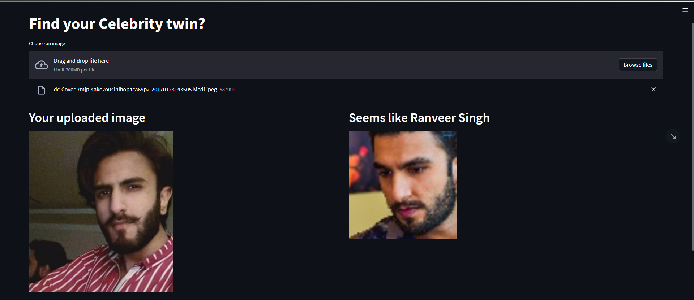

# Find your Celebrity Lookalike

In this data science project we have used deep learning to find closest lookalike from a set of 100 Bolywood Celebrities. Here we have used VGGFace to extract the features from the training data which are images of the Celebrities. Then we find the features from the uploaded image and find closest match using cosine distance.  
 Secondly we used streamlit to create a web API.


## Technologies used in the project

1. Python
2. MTCNN for face extraction
3. Opencv2 and PIL for visualization
4. Tensorflow and VGGFace for model building
5. visual studio code and pycharm as IDE
6. Streamlit
## Data

https://www.kaggle.com/datasets/sushilyadav1998/bollywood-celeb-localized-face-dataset
## Installation

The Code is written in Python 3.6.10. If you don't have Python installed you can find it here. If you are using a lower version of Python you can upgrade using the pip package, ensuring you have the latest version of pip. To install the required packages and libraries, run this command in the project directory after cloning the repository:

```bash
pip install -r requirements.txt
```
    
## Deployement on Heroku

Login or signup in order to create virtual app. You can either connect your github profile or download ctl to manually deploy this project.

[](https://heroku.com)

Our next step would be to follow the instruction given on [Heroku Documentation](https://devcenter.heroku.com/articles/getting-started-with-python) to deploy a web app.
## Future Scope

* Add more Data into the Training
